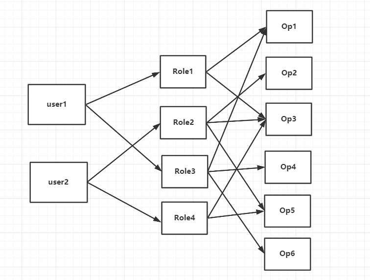
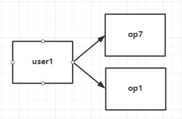

**权限控制**

---
1. 基于角色模型

角色模型核心是一个账号对应多个角色,每个角色对应于相应的权限集合.
其之间的关系为多对多的关系,形式如下:

这个模型可以解决通用角色情况下的权限分配问题, 但是无法实现增删权限功能

2. 使用访问控制列表ACL

访问控制列表中,设置了用户,资源和资源操作的功能,用于对用户进行隐藏权限的赋值

考虑到大量用户的存在, 需要使用用户组对用户权限进行统一管理.
即对用户组进行角色管理,对用户个体进行单独ACL控制

